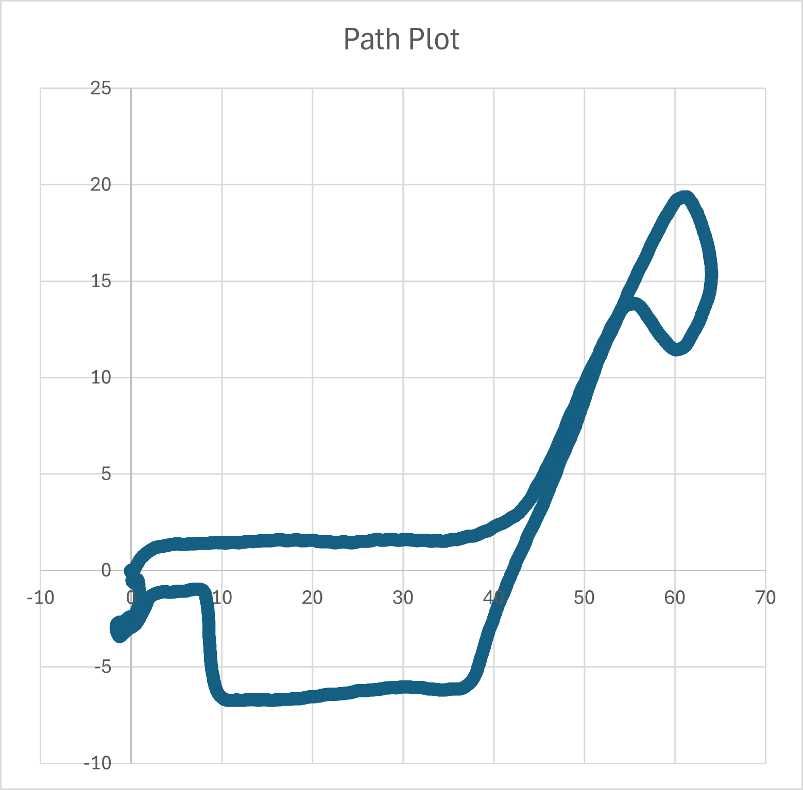
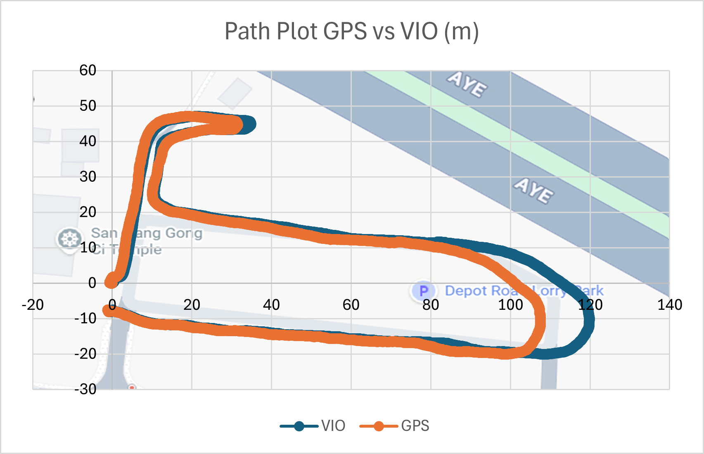
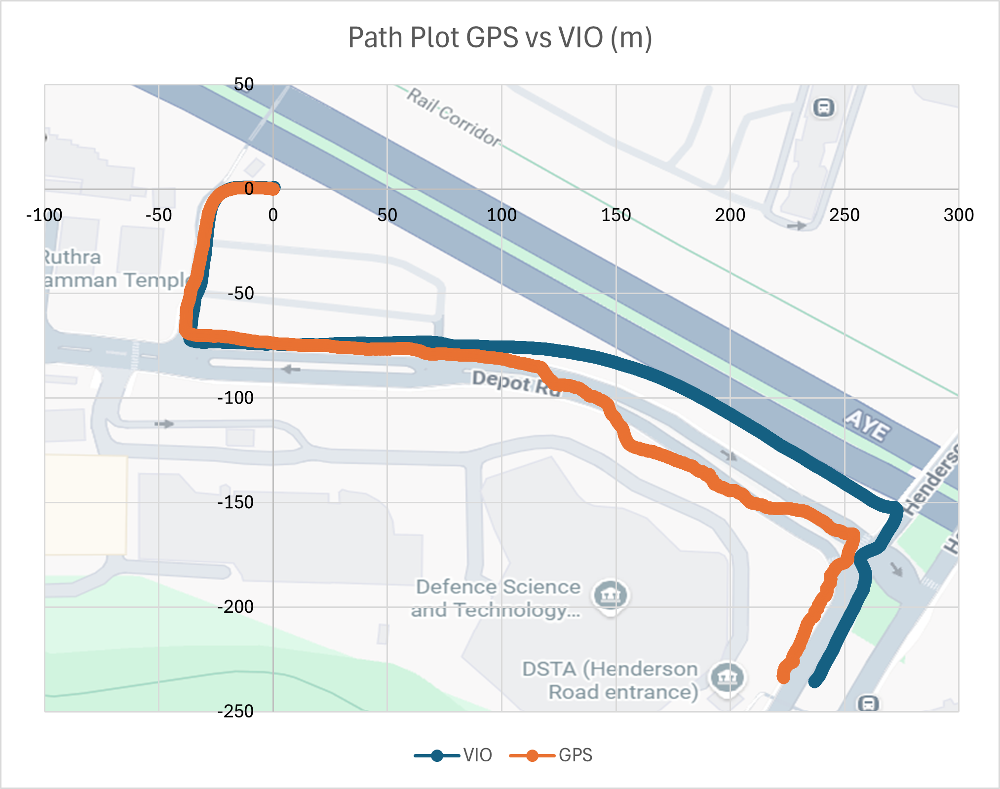

# Basalt VIO for GPS 2D Pose Estimation
Use OAK-D wide stereo camera to conduct Visual Inertial Odometry and simple object detection. 

## 1. Create new target directory and clone repo
```
mkdir basaltVio &&
cd basaltVio &&
git clone https://github.com/cooltech101/vio_for_gps_estimation.git .
```
## 2. Create new virtual environment and install packages
```
python3 -m venv venv &&
source venv/bin/activate &&
pip install -r requirements.txt
```
## 3. Install DepthAI
```
git clone https://github.com/luxonis/depthai-core.git && cd depthai-core
```
```
python3 examples/python/install_requirements.py && cd ..
```
## 4. Run Basalt VIO independently
Headless mode (default)
```
python3 basalt_vio.py
```
With rerun visualizer GUI
```
python3 basalt_vio.py --rerun
```
### Indoor Office Test
- Distance covered: 163.5m
- 3D VIO drift: 0.7153m (0.437%)
- ~20Hz average update rate

(Plots generated in Excel from coordinates logged in csv file)


## 5. Use Basalt VIO to estimate GPS pose (2D)

Run `basalt_vio.py`. Listen for VIO pose packets over Mavlink socket. Manually set starting lat lon and heading in lines 17-19 and use these values to initialise VIO. Using initialisation, script converts local xy coordinates into GPS lat lon coordinates in decimal degrees. Log estimated GPS pose entries to csv file of choice using --csv flag. No flight controller or GPS module needed. 
```
python3 basalt_vio.py & python3 vio_translate_logger.py --csv newLog.csv
```
Run `basalt_vio.py`. Upon startup, average first few GPS readings to determine starting pose. Use this pose as initial VIO offset. Listen for VIO pose packets over Mavlink socket. Log live GPS and heading for each VIO-derived GPS estimate and log entries to csv file of choice using --csv flag. Flight controller and GPS module needed. 
```
python3 basalt_vio.py & python3 vio_gps_logger.py --csv newLog.csv
```
Optional: use `run_gpsvio_logging.sh` to conveniently run `basalt_vio.py` and `vio_gps_logger.py` at the same time. Default output csv `dataLog.csv`. Shell script will cleanly terminate the processes upon interruption via Ctrl+C.
```
./run_gpsvio_logging.sh
```  
### Outdoor Test 1
Distance covered: 333m



### Outdoor Test 2
Distance covered: 507m




## 6. Run simple object tracking
YOLOv6-nano run on OAK-D with visualizer.
```
python3 object_tracker.py
```
Run object tracking and VIO estimation simultaneously.
```
python3 vio_objtrack.py
```
## 7. Helper scripts
Print received GPS coordinates and IMU yaw to terminal. Flight controller and GPS module needed. 
```
python3 read_gps_yaw.py
```
To print GPS coordinates only
```
python3 read_gps.py
```
## 8. Notes
If VIO was run earlier, object tracking will fail because old depthAI pipeline is still active. Reboot host controller, then run object tracking. 


